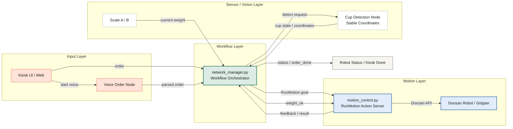
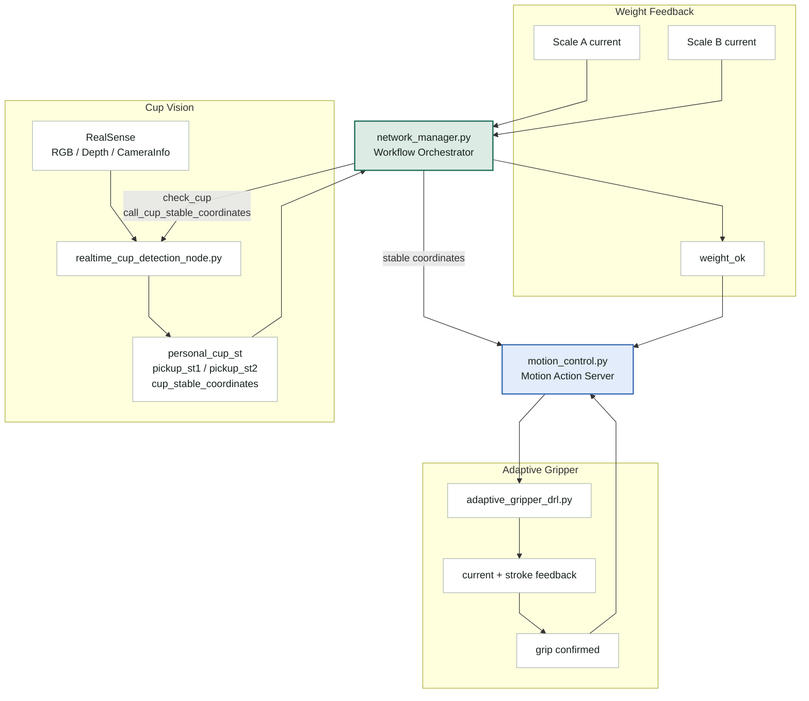
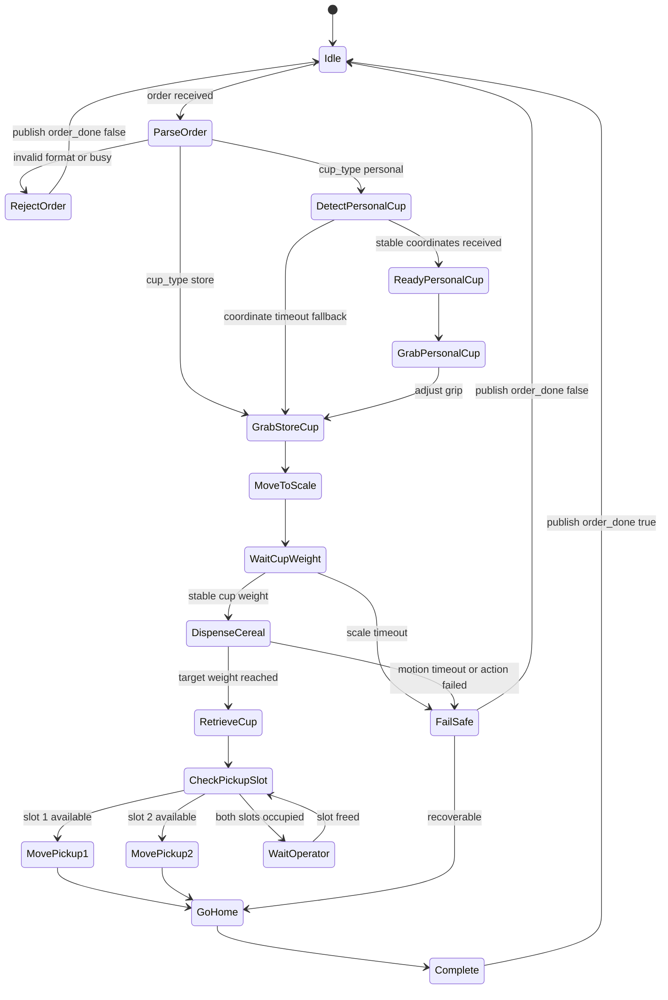
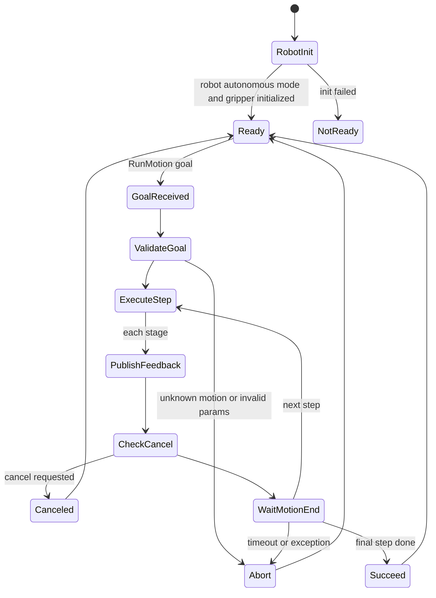

# ROS2 기반 로봇 시스템 설계 자료
> 주문 입력, 비전, 저울, 모션 제어, 상태 피드백을 ROS2 노드 단위로 분리하고, 센서 결과를 검증한 뒤 실제 로봇 동작으로 연결한 프로젝트입니다.

이 자료는 무인 시리얼 카페 로봇 프로젝트를 기준으로, 시스템 아키텍처, 데이터 흐름, 예외 처리 구조, 핵심 로직 설계 방식을 정리한 내용입니다.
---

## 1. 시스템 아키텍처 및 데이터 흐름

### 1-1. ROS2 노드 구성도

아래 구조도는 전체 노드 관계를 한눈에 보기 위한 요약 버전입니다. 세부 토픽명과 데이터 타입은 다음 표에서 따로 정리했습니다.

### 1-2. 세부 센서/제어 흐름

전체 구조도에서 생략한 비전, 저울, 그리퍼 관련 흐름을 별도로 분리했습니다. 발표 시에는 먼저 전체 구조도를 설명한 뒤, 필요한 경우 아래 흐름도로 세부 동작을 보완할 수 있습니다.


### 1-3. 주요 데이터 흐름

| 구분 | 데이터 | 송신 | 수신 | 설계 의도 |
|---|---|---|---|---|
| 주문 입력 | `/dsr01/kiosk/order` | Kiosk / Voice Node | Network Manager | 사용자 입력과 로봇 실행 로직 분리 |
| 모션 요청 | `RunMotion` Action | Network Manager | Motion Control | 장시간 모션의 진행 상태와 결과 추적 |
| 컵 감지 요청 | `/check_cup`, `/call_cup_stable_coordinates` | Network Manager | Cup Detection | 필요한 시점에만 비전 판단 활성화 |
| 컵 상태 응답 | `/cup_detections/*` | Cup Detection | Network Manager | 픽업 위치 점유 여부 판단 |
| 개인컵 좌표 | `/cup_stable_coordinates` | Cup Detection | Network Manager / Motion Control | 안정화된 좌표만 모션 제어에 사용 |
| 무게 측정 | `/weight/scale_*` | Scale | Network Manager | 컵 기준 무게와 시리얼 목표량 계산 |
| 토출 완료 신호 | `/dsr01/weight_ok` | Network Manager | Motion Control | 목표 무게 도달 시 토출 루프 종료 |
| 상태 표시 | `/robot_status`, `/robot_joint_states` | Network Manager | UI / Monitor | 로봇 상태와 조인트 상태 확인 |
| 주문 완료 | `/dsr01/kiosk/order_done` | Network Manager | Kiosk | 성공/실패 결과를 한 번만 발행 |

### 1-4. 지연 시간과 안정성 개선 전략

| 문제 상황 | 적용한 전략 | 기대 효과 |
|---|---|---|
| 비전 판단  | ROI 기반 판단, `verify_fps` 제한, 요청 큐 크기 제한 | 전체 이미지 처리와 불필요한 API 호출을 줄이고, 오래된 판단 요청이 누적되지 않도록 함 |
| 센서 노이즈 | 좌표 안정화 버퍼, 저울 안정화 조건, Depth 대표 픽셀 사용 | 단일 프레임 오검출이나 순간적인 무게 흔들림이 바로 로봇 제어로 이어지지 않도록 함 |
| 장시간 모션 Blocking | ROS2 Action 사용, 모션별 timeout, `MultiThreadedExecutor` | 장시간 동작의 진행 상태와 결과를 추적하고, 콜백 처리가 막히지 않도록 함 |
| 중복 주문 | `busy_lock`으로 작업 실행 보호 | 로봇 작업 중 새 주문이 기존 모션 흐름을 덮어쓰지 않도록 함 |
| 상태 표시  | 상태 토픽 경량화, 별도 status thread | UI/모니터링에 필요한 상태만 주기적으로 발행해 불필요한 데이터 부하를 줄임 |

설계 포인트:

- 비전 판단과 로봇 모션은 처리 시간이 길 수 있어 전체 흐름을 하나의 동기 함수로 묶지 않았습니다.
- 장시간 동작은 ROS2 Action으로 분리해 진행 상태와 결과를 추적했습니다.
- 센서 값은 단일 프레임이나 순간값을 바로 사용하지 않고, 안정화 조건을 통과한 값만 제어 입력으로 사용했습니다.
- 중복 주문이 로봇 동작을 덮어쓰지 않도록 `busy_lock`으로 작업 실행을 보호했습니다.

---

## 2. 예외 처리 및 상태 기구

### 2-1. 주문 처리 FSM



### 2-2. Motion Control 내부 상태



### 2-3. Fail-safe 정책

| 상황 | 감지 방법 | 대응 | 설계 의도 |
|---|---|---|---|
| 주문 중복 입력 | `_busy_lock` | 새 주문 거부 | 작업 중 중복 모션 실행 방지 |
| 액션 전송 지연 | `send_goal` timeout | 실패 반환, 상태 timeout 기록 | 통신 지연을 무한 대기로 두지 않음 |
| 모션 결과 지연 | `get_result` timeout | goal cancel 시도 | 장시간 미응답 모션 차단 |
| 알 수 없는 모션 이름 | handler map 조회 실패 | action abort | 잘못된 명령이 로봇 API까지 전달되지 않도록 차단 |
| 개인컵 좌표 미수신 | 30초 timeout | 매장컵 흐름으로 fallback | 전체 주문 중단보다 서비스 지속성 우선 |
| 카메라 좌표 노이즈 | 좌표 편차 검사 | 안정화 실패 시 재수집 | 단일 프레임 오검출 방지 |
| 저울 값 불안정 | 0.5초 안정 조건 | 컵 무게 기준값 저장 보류 | 컵 무게와 시리얼 무게 분리 |
| 목표 무게 도달 | `/weight_ok` | 토출 반복 중단 | 센서 피드백 기반 동작 종료 |
| 그리퍼 과전류 | gripper current threshold | 목표 stroke 보정 및 grip 확정 | 물체를 과하게 누르지 않는 적응형 파지 |
| 접촉 감지 | Tool force 범위 | quick stop 호출 | 물리 접촉 시 추가 진행 방지 |
| 픽업 위치 모두 점유 | cup detection 상태 | 작업자 수거 대기 | 사람 개입이 필요한 상태를 명확히 분리 |

설계 포인트:

- 로봇 서비스에서는 정상 플로우뿐 아니라 예외 플로우가 중요하다고 판단했습니다.
- timeout, 안정화 조건, busy lock, action result, force feedback을 주요 방어 지점으로 두었습니다.
- 실패 시에는 상태를 초기화하고, 주문 완료 토픽에 실패 결과를 발행해 상위 시스템이 멈춰 있지 않도록 했습니다.

---

## 3. 핵심 알고리즘 의사코드

### 3-1. 주문 오케스트레이션

```text
on_order(order):
    if robot_is_busy:
        publish_order_done(success=false, reason="busy")
        return

    seat, target_g, cup_type = parse(order)
    lock_robot_workflow()

    if cup_type == "personal":
        request_personal_cup_detection()

        if stable_cup_coordinates_received_within_30s:
            run_motion("ready_personal_cup")
            publish_coordinates_to_motion_control()
            run_motion("grab_personal_cup")
            run_motion("grab_cup")  # grip posture normalization
        else:
            # 개인컵 탐지 실패 시 전체 주문을 중단하지 않고 매장컵으로 진행
            run_motion("grab_cup")
    else:
        run_motion("grab_cup")

    run_motion("move_to_a_or_b")

    if not wait_for_stable_weight(min_weight=10g, timeout=15s):
        fail_order("cup not detected on scale")
        return

    start_weight_monitor_thread(target_g)
    run_motion("give_cereal_a_or_b")

    run_motion("retrieve_cup_from_a_or_b")
    decide_pickup_slot_by_cup_detection()
    run_motion("move_pickup_1_or_2")
    run_motion("go_home")

    publish_order_done(success=true)
    reset_workflow_state()
```

설계 의도:

- 주문 판단과 실제 모션 실행을 분리해 디버깅 범위를 줄였습니다.
- 모든 모션은 `run_motion` 공통 함수로 실행해 timeout, result, 실패 처리를 일관화했습니다.
- 개인컵 좌표 탐지에 실패해도 전체 주문을 바로 실패시키지 않고, 매장컵 흐름으로 전환할 수 있게 했습니다.
- 저울 모니터링을 별도 스레드로 실행해 토출 모션과 목표 무게 판단을 동시에 처리했습니다.

### 3-2. 개인컵 좌표 안정화

```text
process_personal_cup_coords(camera_xyz):
    if first_detection:
        start_time = now
        buffer = [camera_xyz]
        return

    buffer.append(camera_xyz)

    if elapsed_time < 0.8 seconds:
        return

    avg = mean(buffer)

    if any(point is farther than stable_radius from avg):
        # depth noise or false positive suspected
        restart_collection()
        return

    robot_xyz = transform_camera_to_robot(avg)
    publish("/cup_stable_coordinates", robot_xyz)
    clear_buffer()
```

설계 의도:

- 카메라와 Depth 기반 좌표는 프레임마다 흔들릴 수 있어 단일 프레임 결과를 바로 사용하지 않았습니다.
- 여러 프레임의 좌표를 모아 평균을 내고, 편차가 일정 반경 안에 들어오는 경우에만 안정 좌표로 판단했습니다.
- 안정화된 좌표만 로봇 좌표계로 변환해 모션 제어 노드에 전달했습니다.

최적화 포인트:

- 전체 화면 대신 ROI만 판단해 비전 처리량을 줄였습니다.
- Realtime 호출 FPS를 제한해 API 지연이 ROS2 콜백 흐름을 막지 않도록 했습니다.
- RGB 판단과 Depth 대표 픽셀을 함께 사용해 실제 제어에 필요한 3D 좌표를 계산했습니다.

### 3-3. 저울 기반 토출 제어

```text
wait_for_stable_weight(min_weight, timeout):
    while within_timeout:
        current = read_active_scale()

        if current >= min_weight:
            if abs(current - previous) < 2g for 0.5 seconds:
                cup_weight = current
                return true

        previous = current

    return false


monitor_weight(target_cereal_g):
    absolute_target = cup_weight + target_cereal_g

    while dispensing:
        current = read_active_scale()
        cereal_weight = current - cup_weight

        if current >= absolute_target:
            publish("/dsr01/weight_ok", true)
            break
```

설계 의도:

- 컵마다 무게가 다르기 때문에 저울의 절대 무게만으로는 목표 시리얼 양을 정확히 판단하기 어렵습니다.
- 먼저 컵이 올라간 뒤 안정화된 무게를 baseline으로 저장하고, 이후에는 현재 무게와 baseline의 차이를 시리얼 양으로 계산했습니다.
- 목표 무게에 도달하면 `weight_ok`를 발행해 모션 제어 노드의 토출 반복을 종료하도록 했습니다.

### 3-4. 전류 피드백 기반 적응형 그리퍼 제어

`adaptive_gripper_drl.py`는 Doosan DRL 스크립트를 생성해 `/dsr01/drl/drl_start` 서비스로 실행하고, DRL 내부에서 플랜지 시리얼 통신과 Modbus 명령으로 그리퍼를 제어합니다.

핵심은 목표 stroke만 보내는 것이 아니라, 현재 전류와 현재 stroke를 함께 읽으면서 물체 접촉 여부를 판단한 점입니다.

```text
gripper_move(target_stroke):
    clamp target_stroke to 0..740

    set_profile_velocity(v_raw)
    set_goal_current(low_current_limit)
    send_goal_position(target_stroke)

    consecutive_high = 0
    first_detect_pos = None

    while true:
        current_mA, current_stroke = read_current_and_position()
        export_stroke(current_stroke)

        if current_mA >= CURRENT_THRESHOLD:
            if consecutive_high == 0:
                first_detect_pos = current_stroke
                hold_position(first_detect_pos)

                safe_target = first_detect_pos + SAFETY_MARGIN
                if safe_target < target_stroke:
                    send_goal_position(safe_target)

                current_mA, current_stroke = read_current_and_position()

                if current_mA >= CURRENT_THRESHOLD:
                    consecutive_high += 1
                else:
                    reset_counter()
                    send_goal_position(target_stroke)

            if consecutive_high >= REQUIRED_COUNT:
                confirm_grip()
                break

        if abs(current_stroke - target_stroke) <= tolerance:
            break
```

설계 의도:

- 그리퍼를 목표 위치까지 무조건 닫는 방식이 아니라, 전류 상승을 통해 물체 접촉 가능성을 판단했습니다.
- 전류가 임계값을 넘는 순간의 stroke를 기록하고, `SAFETY_MARGIN`을 더한 안전 목표 위치로 보정해 과도한 압착을 줄였습니다.
- 한 번의 전류 spike만으로 파지를 확정하지 않고, 연속 감지 조건을 두어 순간 노이즈를 방어했습니다.
- 현재 stroke를 digital output으로 내보내 외부 로직이 그리퍼 상태를 확인할 수 있도록 했습니다.
- DRL 실행 상태를 `/dsr01/drl/get_drl_state`로 확인하고 timeout을 두어, 그리퍼 명령이 끝나지 않는 상황을 방지했습니다.

### 3-5. Tool Force 기반 접촉 감지

```text
wait_for_contact(axis, min_force, max_force, timeout):
    while within_timeout:
        force = get_tool_force()
        selected_axis_force = force[axis]

        if min_force <= selected_axis_force <= max_force:
            quick_stop()
            return true

        sleep(short_interval)

    return false
```

설계 의도:

- 로봇이 물체나 토출 장치에 접근할 때 좌표만으로는 실제 접촉 여부를 보장하기 어렵습니다.
- Tool force를 주기적으로 확인하고 목표 force 범위에 들어오면 `quick_stop`을 호출해 더 밀고 들어가지 않도록 했습니다.
- 접촉이 감지되지 않는 경우에도 timeout을 두어 무한 대기하지 않도록 했습니다.

## 4. 정리

제가 준비한 코드는 ROS2 기반 무인 시리얼 카페 로봇 시스템입니다. 구조적으로는 주문 입력, 워크플로우 관리, 비전 판단, 저울 피드백, 실제 모션 제어를 노드 단위로 분리했습니다.

핵심 노드인 `network_manager_v6.py`는 전체 작업 흐름을 관리합니다. 주문이 들어오면 컵 종류, 좌석, 목표 무게를 파싱하고, 개인컵인 경우 비전 노드에 좌표 탐지를 요청합니다. 이후 안정화된 좌표와 저울 값을 확인한 뒤, `RunMotion` 액션으로 모션 제어 노드에 단위 동작을 요청합니다.

`motion_control_6.py`는 실제 로봇 동작을 담당합니다. 각 모션을 함수 단위로 나누고, `movej`, `movel`, `movejx` 같은 명령은 완료 대기와 timeout을 포함한 wrapper로 실행했습니다. 각 단계에서는 feedback을 발행하고, 실패나 취소가 발생하면 action result로 상위 노드가 알 수 있도록 했습니다.

제가 특히 신경 쓴 부분은 센서 결과를 바로 로봇 제어에 넣지 않는 것입니다. 카메라 좌표는 안정화 버퍼를 거치고, 저울 값은 컵 무게를 baseline으로 잡은 뒤 시리얼 증가분을 계산했습니다. 그리퍼는 전류와 stroke를 함께 확인해 적응형으로 파지하고, 로봇 팔의 접촉 동작에서는 tool force를 확인해 quick stop을 호출하는 방식으로 실제 현장에서 발생할 수 있는 노이즈와 예외 상황을 코드로 방어했습니다.

---
